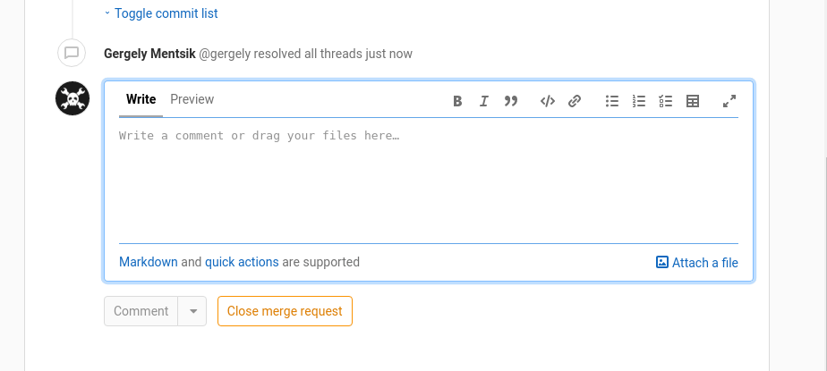
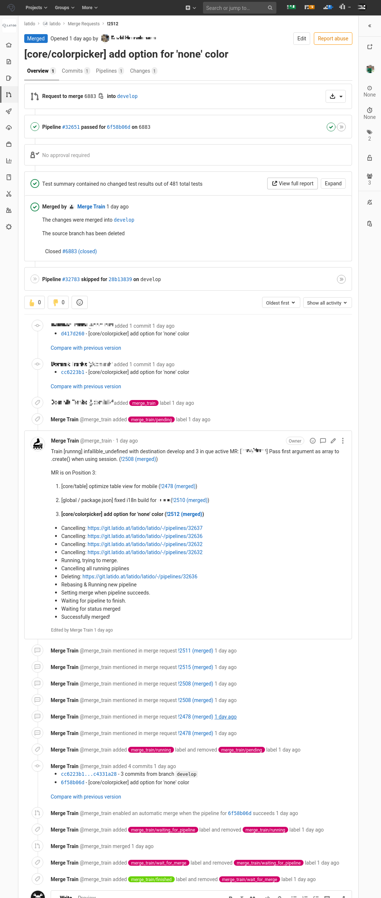
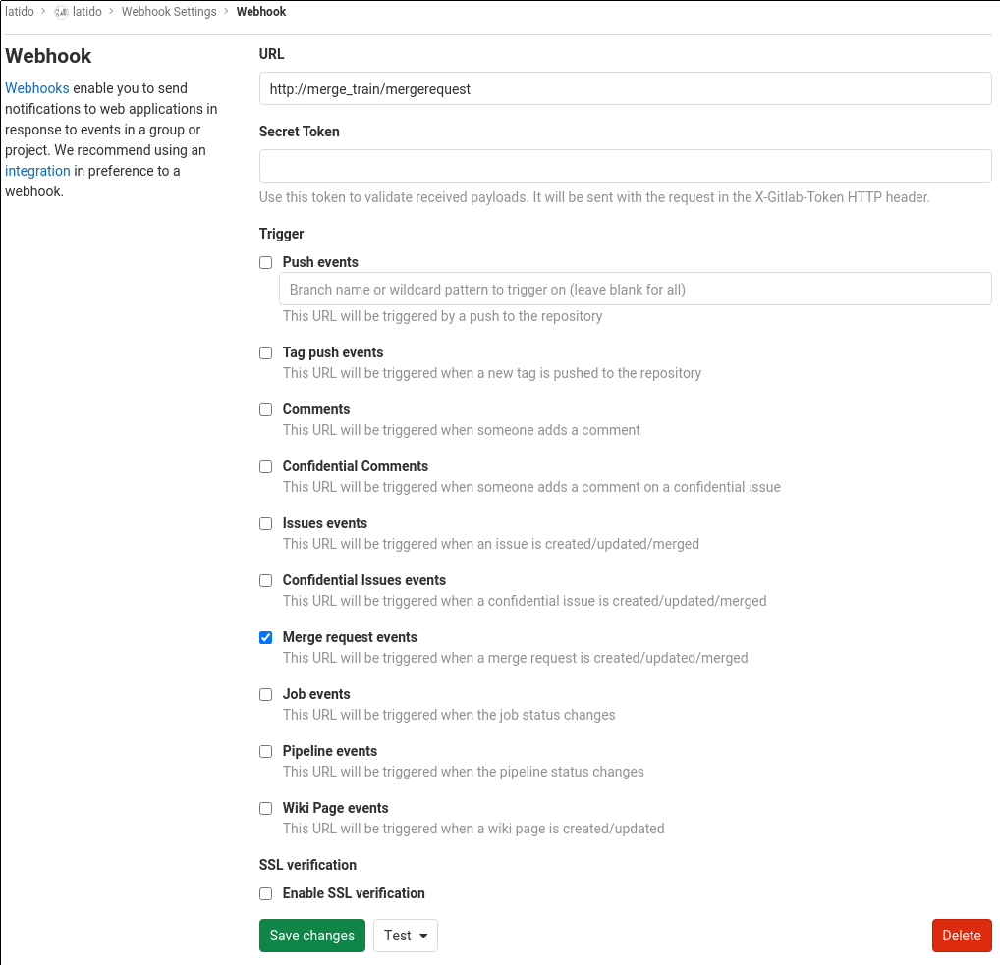

# Gitlab Merge Train

... a simple way to automatically queue, rebase and merge for your development cycle.





## Screenshot



## How does it work?

1. The service provides a simple queue for merge requests
2. Each target branch has its own queue (`feature_branch_x` -> `staging`, `staging` is the target branch)
3. Add a merge request to the queue by adding the `merge_train` label in Gitlab
4. GMRT will add the merge request to the queue and cancel all pending or running pipelines (see below why)
5. GMRT will then wait for any merge-request to finish (or fail) that is in front of the added one in the queue
6. GMRT will finally **rebase** and activate **merge when pipeline succeeds**
7. Wait for the result (success/fail/timeout) and process next merge request in queue 

This will cause an automatic merge when the pipeline succeeds.

Every output of the train for a merge-request will be added as a (single) comment to the merge-request.
Additionally, each stage and state has its own label, so you can eg. filter all failed merge-requests:

**why does it cancel all running pipelines for the merge-request?**
Since we assume that the branch has to be rebased anyway, there is no point running the pipeline without rebasing first.


## Deployment
Build and Deploy the provided Dockerfile, you can also use the [provided docker-image](https://hub.docker.com/r/latidohealthtech/gitlab-merge-train) You need to configure at least 3 environment variables:
```
  MERGE_TRAIN_PORT: "80"
  GITLAB_TOKEN: "XXXXXXXX"
  GITLAB_HOST: "gitlab.yourhost.com"
```

The Gitlab-Token is an **Impersonation Token**. You can either create your merge-train user, or just generate one from your account-settings.
Finally, you need to setup a webhook for your project, this sends a http-request to the service when a merge-request is created, updated:



**Important**: if your service is external, please make sure to use SSL

## Building
You need typescript, node and npm

1. `npm install`
2. `npm run build`
3. `docker build`

## Why?
When using Gitlab with pipelines, you will often find yourself waiting for pipelines to finish. Especially if you are doing a lot of automated testing, these pipelines can take some time.
During this time the target branch will often change, requiring someone to manage merges into the target branches (eg `develop`, `staging`, `master`), meaning waiting for the pipeline to finish, rebasing it, waiting for the pipeline to finish again and finally merge it.

This process is cumbersome and can be easily automated with GMRT.
